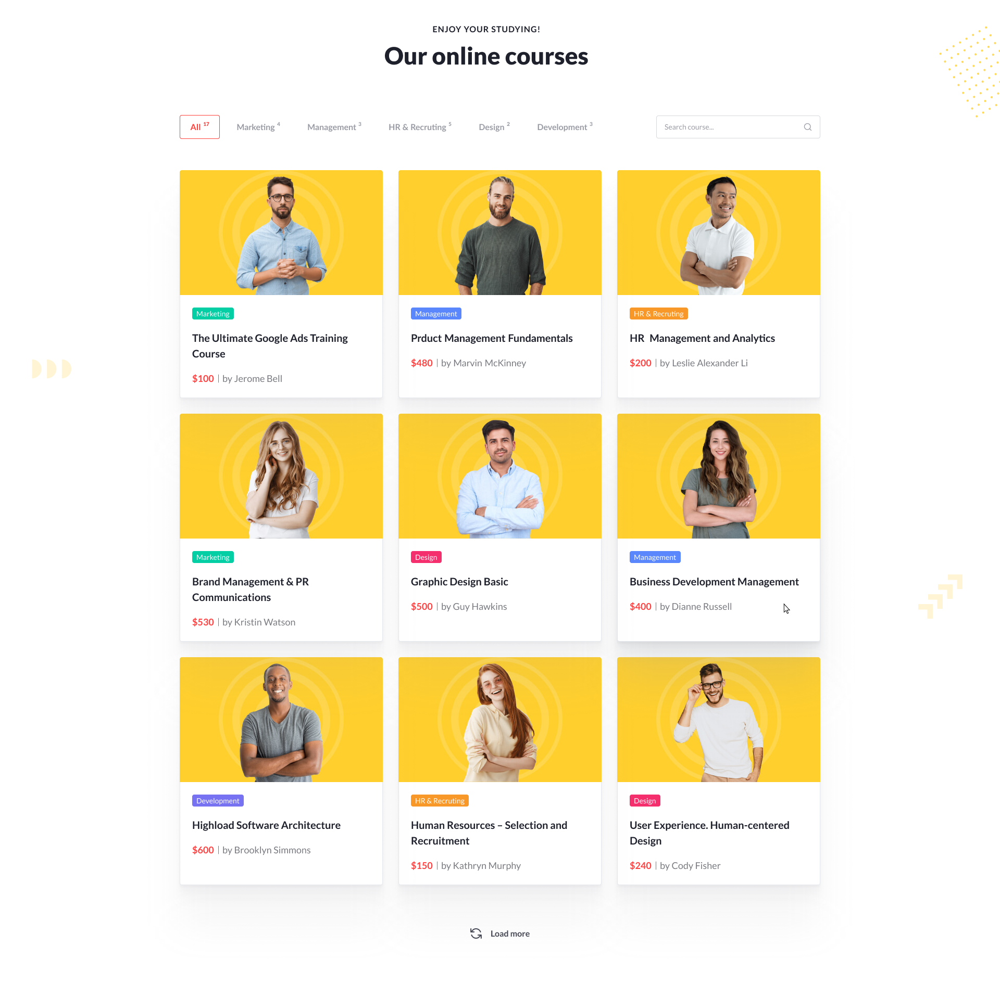
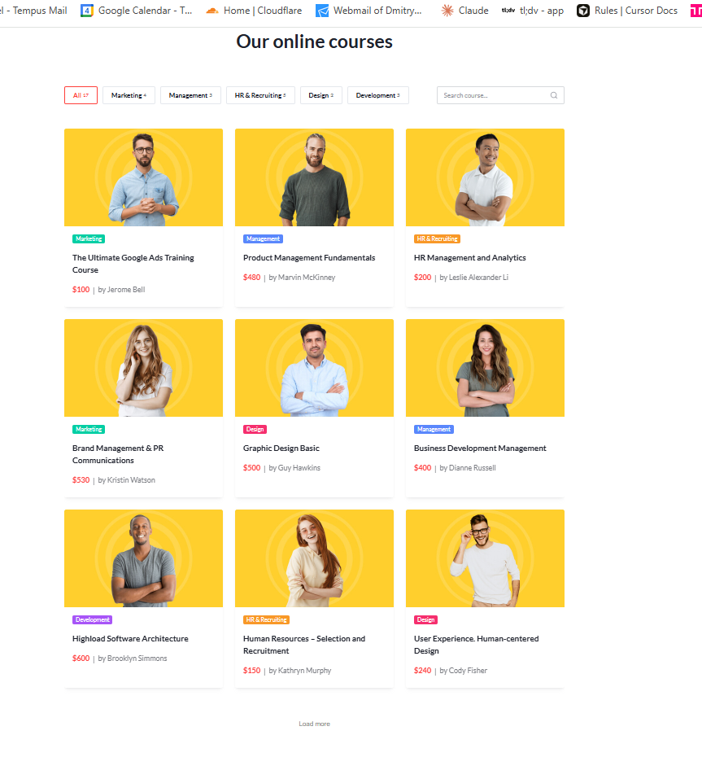

# 🎓 Online Courses — Test Task

Адаптивный каталог онлайн-курсов, сверстанный по макету Figma и реализованный на чистом HTML, SCSS и Vanilla JavaScript.

Проект включает фильтрацию по категориям, живой поиск, динамическую подгрузку карточек и плавные анимации.

---

## 🚀 Demo & Code

👉 **Live Demo (Vercel):** https://your-project-name.vercel.app

👉 **GitHub Repository:** https://github.com/your-username/your-repository

(после деплоя просто подставьте реальные ссылки)

---

## 🎯 Pixel-perfect comparison

Ниже представлено сравнение макета Figma и итоговой верстки.  
Сетка, типографика, отступы и расположение элементов соответствуют исходному дизайну.

| Макет Figma                    | Итоговая верстка                        |
| ------------------------------ | --------------------------------------- |
|  |  |

---

## 📌 Реализованный функционал

### ✔ 1. Pixel-perfect вёрстка

Полное соответствие макету Figma (1920px → мобильные разрешения), корректная типографика и отступы.

### ✔ 2. Полностью резиновый адаптив

Интерфейс масштабируется плавно, без жёстких брейкпоинтов.

### ✔ 3. Поиск по курсам (live search)

Мгновенный фильтр по:

- названию курса

- имени автора

Работает без перезагрузки страницы.

### ✔ 4. Фильтрация по категориям

- Динамические счётчики (All 17, Marketing 4 и т.д.)

- Подсветка активной категории

- Фильтры работают совместно с поиском

### ✔ 5. Кнопка "Load more" + спиннер

- Отображение по 9 карточек

- Имитация задержки загрузки

- Плавная анимация появления карточек

### ✔ 6. Чистый JavaScript (ES Modules)

Без библиотек и фреймворков.

Использованы:

- модули (`import/export`)

- чистые функции

- централизованное состояние (category, search, visibleCount)

### ✔ 7. SCSS-модули + методология БЭМ

- `_tokens.scss` — переменные

- `_mixins.scss` — миксины

- `base.scss`, `layout.scss`, `main.scss`

- БЭМ-классы: `block__element--modifier`

---

## 🧩 Стек технологий

- **HTML5**

- **SCSS**

- **JavaScript (ES6 Modules)**

- **BEM**

- **Vercel** (деплой)

---

## 📁 Структура проекта

```
dmitry_n_test/
├── assets/
│   ├── icons/
│   │   └── spinner.svg
│   └── images/
│       ├── *.jpg (изображения авторов)
│       └── placeholder.jpg
├── dist/
│   └── css/
│       └── main.css (скомпилированный CSS)
├── src/
│   ├── components/
│   │   ├── card/
│   │   │   └── card.scss
│   │   ├── categories/
│   │   │   └── categories.scss
│   │   └── search/
│   │       └── search.scss
│   ├── js/
│   │   ├── app.js (основная логика)
│   │   └── data.js (данные курсов)
│   └── styles/
│       ├── _tokens.scss (дизайн-токены)
│       ├── _mixins.scss (миксины)
│       ├── base.scss (базовые стили)
│       ├── layout.scss (layout)
│       └── main.scss (главный файл)
├── index.html
├── package.json
└── README.md
```

---

## 🛠 Установка и запуск

1. **Клонируйте репозиторий:**

```bash
git clone https://github.com/your-username/your-repository.git
cd dmitry_n_test
```

2. **Установите зависимости:**

```bash
npm install
```

3. **Запустите компиляцию SCSS (watch mode):**

```bash
npm run sass
```

4. **Откройте `index.html` в браузере**

---

## 📝 Скрипты

- `npm run sass` — компиляция SCSS в watch mode
- `npm run scss:build` — одноразовая компиляция SCSS

---

## 🎨 Особенности реализации

- **Design Tokens**: все цвета, размеры, отступы вынесены в `_tokens.scss`
- **Миксины**: переиспользуемые стили в `_mixins.scss`
- **БЭМ**: строгое следование методологии БЭМ
- **Responsive**: использование `clamp()` для плавного масштабирования
- **Анимации**: fade-in эффект при загрузке карточек
- **Accessibility**: семантическая разметка и правильные ARIA-атрибуты

---

## 📄 Лицензия

Этот проект создан в рамках тестового задания.
